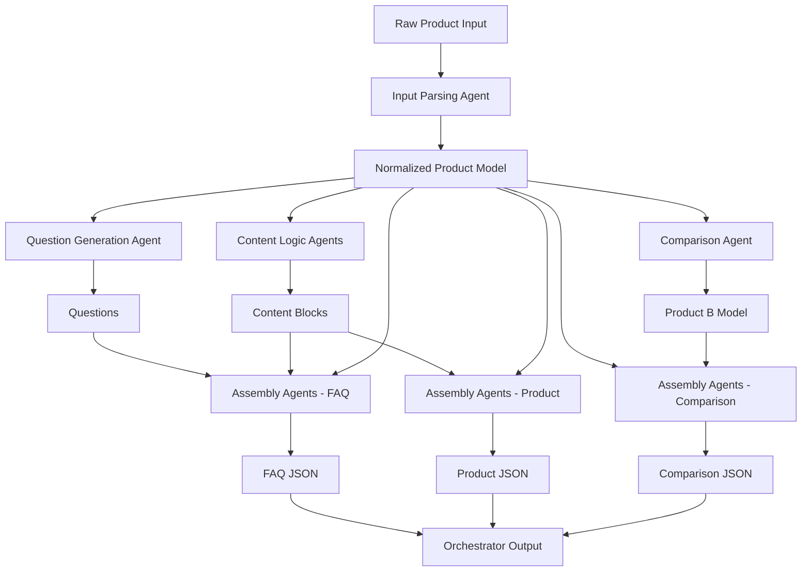
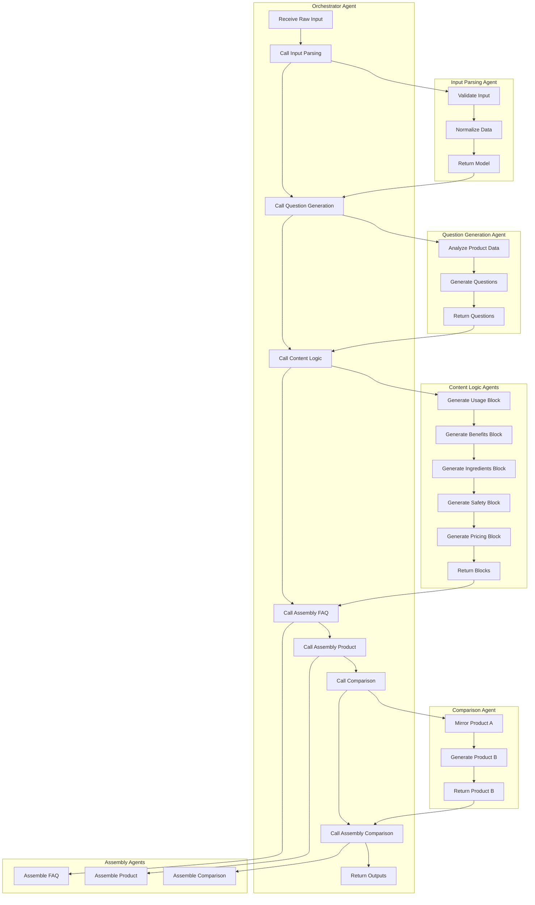
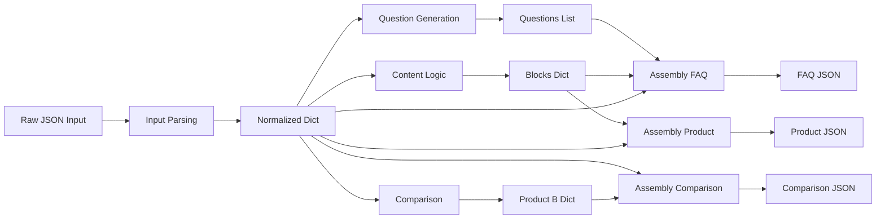
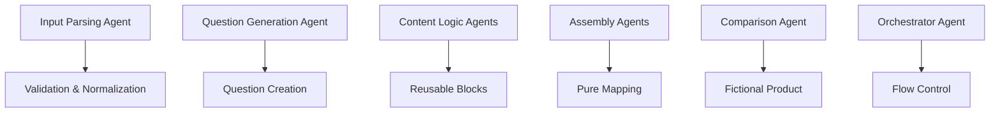

# Agent Flow Visualization

This document contains visualizations of the Multi-Agent Product Content Generation System flow.

## Overall System Flow

## Agent Interaction Flow

## Data Transformation Flow

## Agent Responsibility Matrix

These diagrams show the modular, agent-based architecture with clear data flow and responsibilities.