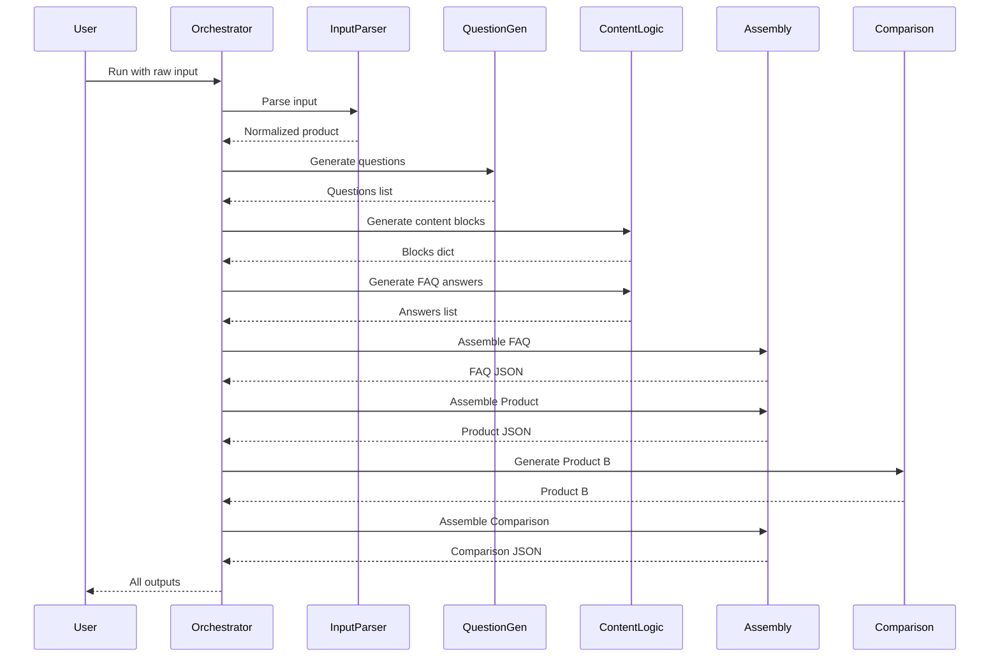
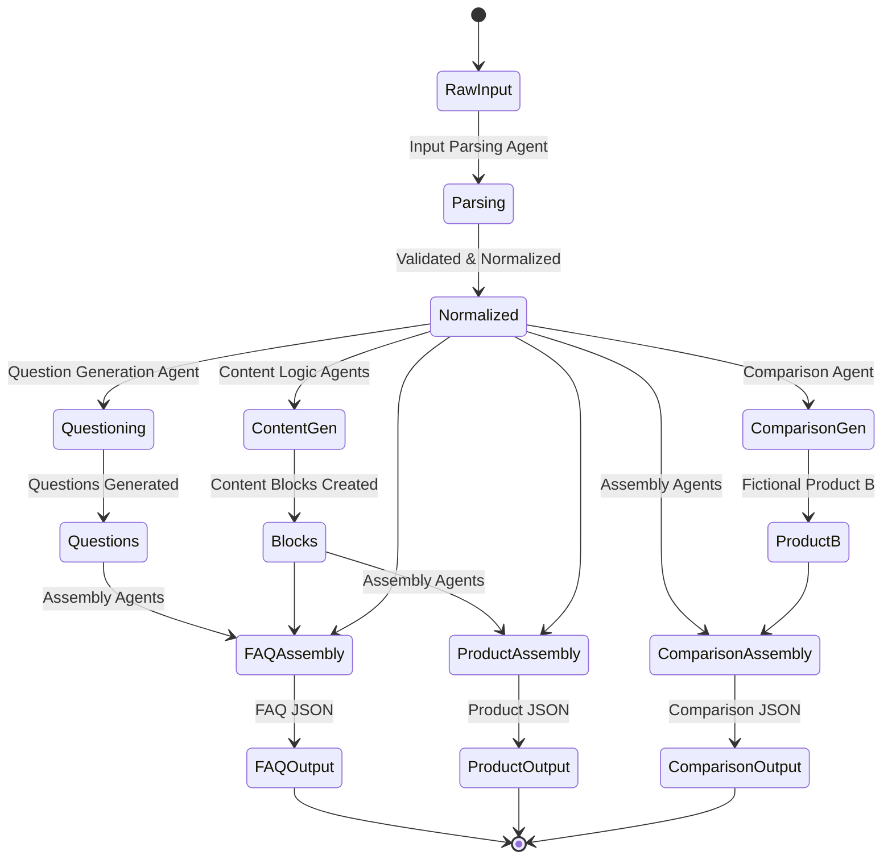

# Sequence Diagram

This document shows the sequence of agent interactions.

```mermaid
sequenceDiagram
    participant User
    participant Orchestrator
    participant InputParser
    participant QuestionGen
    participant ContentLogic
    participant Assembly
    participant Comparison

    User->>Orchestrator: Run with raw input
    Orchestrator->>InputParser: Parse input
    InputParser-->>Orchestrator: Normalized product
    Orchestrator->>QuestionGen: Generate questions
    QuestionGen-->>Orchestrator: Questions list
    Orchestrator->>ContentLogic: Generate content blocks
    ContentLogic-->>Orchestrator: Blocks dict
    Orchestrator->>ContentLogic: Generate FAQ answers
    ContentLogic-->>Orchestrator: Answers list
    Orchestrator->>Assembly: Assemble FAQ
    Assembly-->>Orchestrator: FAQ JSON
    Orchestrator->>Assembly: Assemble Product
    Assembly-->>Orchestrator: Product JSON
    Orchestrator->>Comparison: Generate Product B
    Comparison-->>Orchestrator: Product B
    Orchestrator->>Assembly: Assemble Comparison
    Assembly-->>Orchestrator: Comparison JSON
    Orchestrator-->>User: All outputs
```

## State Diagram

```mermaid
stateDiagram-v2
    [*] --> RawInput
    RawInput --> Parsing: Input Parsing Agent
    Parsing --> Normalized: Validated & Normalized
    Normalized --> Questioning: Question Generation Agent
    Questioning --> Questions: Questions Generated
    Normalized --> ContentGen: Content Logic Agents
    ContentGen --> Blocks: Content Blocks Created
    Questions --> FAQAssembly: Assembly Agents
    Blocks --> FAQAssembly
    Normalized --> FAQAssembly
    FAQAssembly --> FAQOutput: FAQ JSON
    Blocks --> ProductAssembly: Assembly Agents
    Normalized --> ProductAssembly
    ProductAssembly --> ProductOutput: Product JSON
    Normalized --> ComparisonGen: Comparison Agent
    ComparisonGen --> ProductB: Fictional Product B
    Normalized --> ComparisonAssembly: Assembly Agents
    ProductB --> ComparisonAssembly
    ComparisonAssembly --> ComparisonOutput: Comparison JSON
    FAQOutput --> [*]
    ProductOutput --> [*]
    ComparisonOutput --> [*]
```